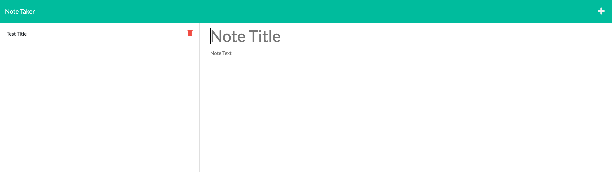

# Note Taker Front-end App

## Description
This JS application can be used to write and save notes. It uses Express.js as the backend and saves and retrieves notes data from a JSON file.

## Table of Contents
- [Prerequisites](#prerequisites)
- [Installation](#installation)
- [Usage](#usage)
- [Credits](#credits)
- [License](#license)

## Prerequisites
* Since this is a node.js app, you will need to install node.js in your laptop.  
    * Download the latest version of node.js here --> https://nodejs.org/en/download/  
* After node.js has been installed on your machine, you will need to install npm.  
    * Follow the steps in the following website to install npm --> https://docs.npmjs.com/cli/v9/commands/npm-install?v=true  

Once those two prerequisites have been installed on your laptop proceed to the Installation steps

## Installation
1) Clone or download the ZIP to your local repository
2) Open a CLI terminal
3) Navigate to your <code>noteTakerRepo/Develop</code> folder 
4) Run the following command to install the necessary npm packages (express.js, fs, and others):
    <pre>npm i</pre>
4) Run the <code>express.js</code> with the following command:
    <pre>nodemon express.js</pre>
5) Open a web browser and navigate to the following page
<code>http://localhost:3000/notes</code>. 
6) Start using your Note Taker Locally!

You don't want to go through all these steps and have an express terminal open? No problem, there is an already deployed Note Taker App that I have deployed using Heroku; just visit this website

## Usage 